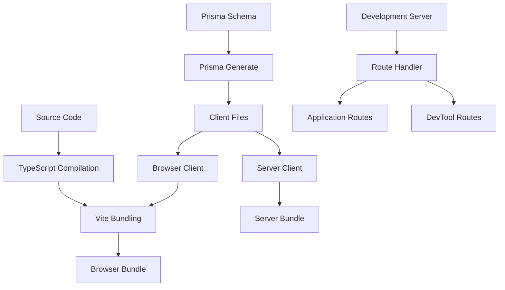

# Design Document

## Overview

The development environment is experiencing critical issues due to a mismatch between ES module imports and CommonJS exports in the Prisma client browser bundle. The application uses ES module syntax (`import { OrganisationGroupType } from '@prisma/client'`) but the browser version of the Prisma client exports using CommonJS syntax (`exports.OrganisationGroupType`). Additionally, the development server lacks proper handling for browser development tool requests.

## Architecture

The solution involves three main components:

1. **Prisma Client Configuration**: Ensure proper client generation with correct module format for browser environments
2. **Build System Integration**: Configure Vite and bundling to handle Prisma client imports correctly
3. **Development Server Enhancement**: Add proper route handling for development tool requests



## Components and Interfaces

### 1. Prisma Client Generator Configuration

**Purpose**: Ensure Prisma generates browser-compatible client exports

**Configuration**:
- Update Prisma schema generator settings
- Ensure proper ES module exports for browser environment
- Maintain CommonJS compatibility for server environment

### 2. Vite Build Configuration

**Purpose**: Handle Prisma client imports correctly in browser bundle

**Key Changes**:
- Configure proper module resolution for Prisma client
- Set up aliases for browser vs server client versions
- Ensure correct bundling of enum types

### 3. Development Server Route Handler

**Purpose**: Handle browser development tool requests gracefully

**Implementation**:
- Add catch-all route for well-known paths
- Implement proper 404 responses for unmatched routes
- Add logging for debugging purposes

### 4. Module Resolution System

**Purpose**: Ensure correct import/export handling across environments

**Components**:
- Browser module resolver
- Server module resolver
- Type definition alignment

## Data Models

### Prisma Client Export Structure

```typescript
// Expected browser exports (ES modules)
export declare enum OrganisationGroupType {
  INTERNAL_ORGANISATION = "INTERNAL_ORGANISATION",
  INTERNAL_TEAM = "INTERNAL_TEAM", 
  CUSTOM = "CUSTOM"
}

// Current browser exports (CommonJS)
exports.OrganisationGroupType = {
  INTERNAL_ORGANISATION: "INTERNAL_ORGANISATION",
  INTERNAL_TEAM: "INTERNAL_TEAM",
  CUSTOM: "CUSTOM"
}
```

### Route Configuration

```typescript
interface RouteConfig {
  path: string;
  handler: (request: Request) => Response;
  method: string[];
}

interface DevToolRoute extends RouteConfig {
  isDevTool: boolean;
  fallback: boolean;
}
```

## Correctness Properties

*A property is a characteristic or behavior that should hold true across all valid executions of a system-essentially, a formal statement about what the system should do. Properties serve as the bridge between human-readable specifications and machine-verifiable correctness guarantees.*

### Property 1: Prisma Client Browser Compatibility
*For any* Prisma client import in the browser environment, all exported types and enums (including OrganisationGroupType) should be accessible and have the correct values without syntax errors
**Validates: Requirements 1.1, 1.2, 1.3, 1.4**

### Property 2: Development Server Graceful Error Handling  
*For any* unmatched route or development tool request, the server should handle it gracefully without crashing and provide appropriate responses (404 for unmatched routes, proper handling for DevTools)
**Validates: Requirements 2.2, 2.3**

### Property 3: Build System Correctness
*For any* build process execution, the system should generate browser-compatible Prisma client exports, resolve all TypeScript imports correctly, and ensure all generated files are up to date
**Validates: Requirements 3.1, 3.2, 3.3, 3.4**

### Property 4: Error Message Quality
*For any* error condition (import errors, route failures, Prisma issues, environment problems), the system should provide clear, actionable error messages with specific remediation steps
**Validates: Requirements 4.1, 4.2, 4.3, 4.4**

## Error Handling

### Import Resolution Errors
- Detect when Prisma client imports fail
- Provide clear error messages indicating missing exports
- Suggest regenerating Prisma client as remediation

### Route Handling Errors
- Catch unmatched route requests
- Log detailed request information for debugging
- Return appropriate HTTP status codes
- Handle development tool requests gracefully

### Build System Errors
- Detect TypeScript compilation failures
- Identify Prisma client generation issues
- Provide actionable error messages with specific steps
- Suggest dependency updates or configuration fixes

### Development Environment Issues
- Monitor for common development problems
- Provide diagnostic information
- Suggest specific remediation steps
- Include links to relevant documentation

## Testing Strategy

### Unit Tests
- Test specific import scenarios with mocked Prisma client
- Test route handler behavior with various request types
- Test build system components in isolation
- Test error message generation and formatting

### Property-Based Tests
- **Property 1**: Generate random Prisma client usage scenarios and verify all exports are accessible
- **Property 2**: Generate random HTTP requests and verify graceful handling
- **Property 3**: Generate various build configurations and verify correct output
- **Property 4**: Generate error conditions and verify message quality

### Integration Tests
- Test complete development server startup process
- Test Prisma client regeneration workflow
- Test browser bundle generation and loading
- Test end-to-end import resolution

### Configuration
- Use Vitest for property-based testing with fast-check library
- Run minimum 100 iterations per property test
- Tag each test with feature name and property reference
- Include both positive and negative test cases